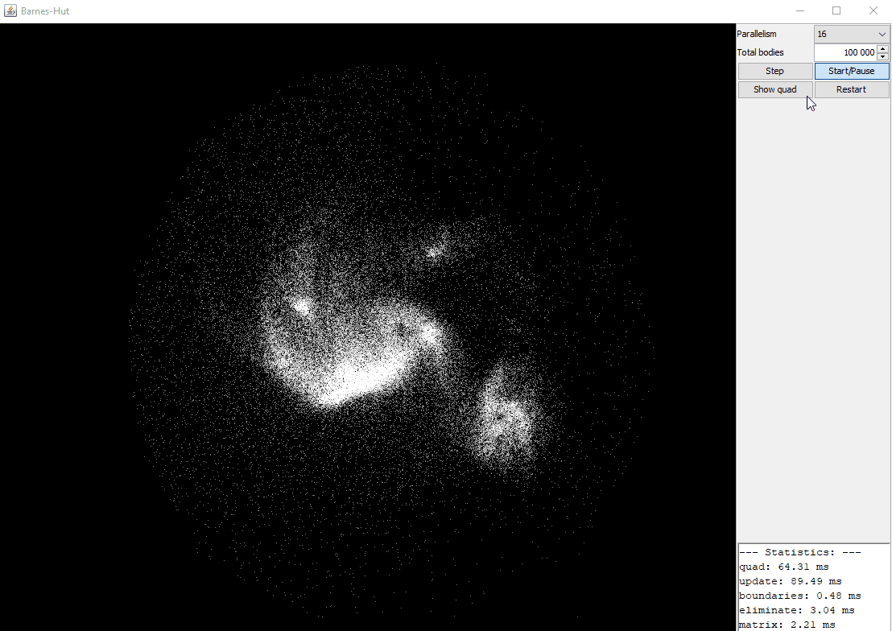

# parallel-programming
Coursera course on parallel programming in Scala [website](https://www.coursera.org/learn/parprog1).

## Running
Tested with JDK 8 (you will likely run in to trouble with newer JDK). Tested on Windows: if you have multiple JDK's installed, create an env variable `JAVA_HOMES` that points to the root of all the JDK installs and add that to `PATH`. Additionally, you will need to add a file `.java-version` to the project root which contains the subfolder for the JDK 8 installation.

Once set up, run the projects with `sbt run` from the project root.

## Barnes-Hut simulation visualized (week4 exercise)

